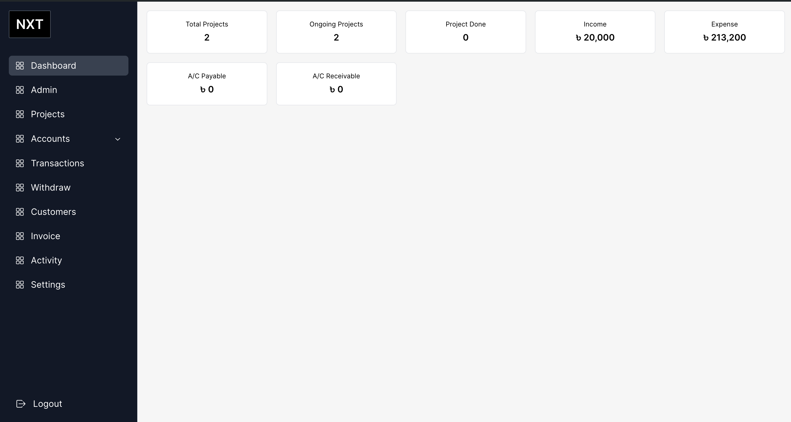
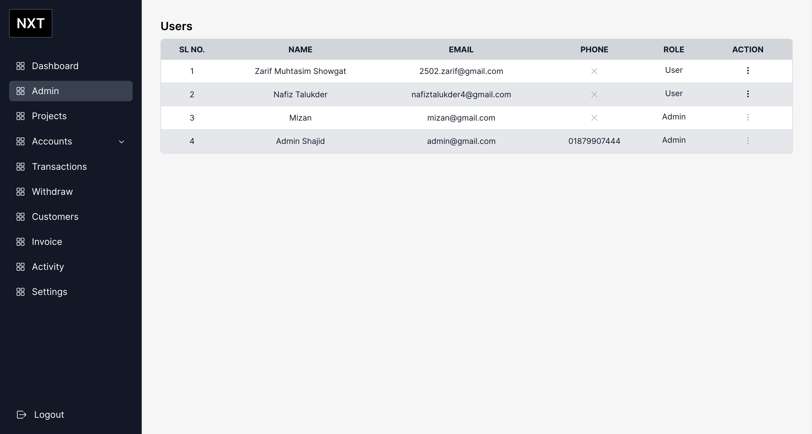
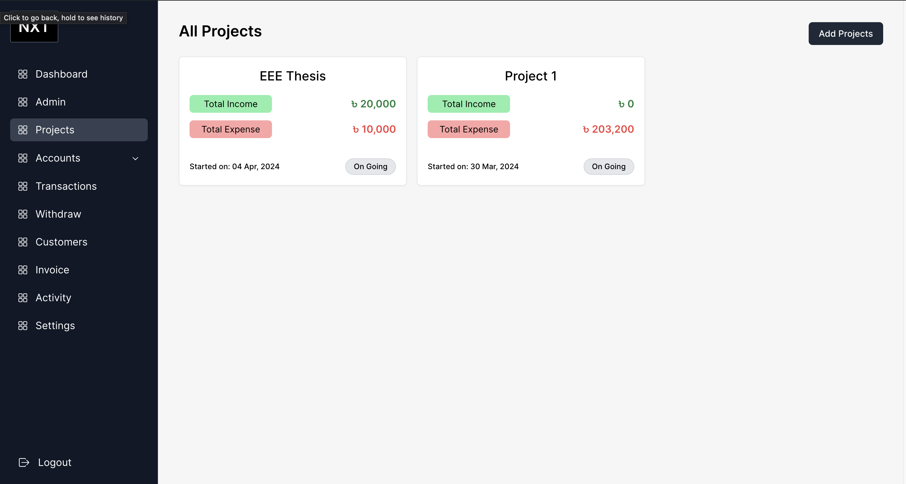
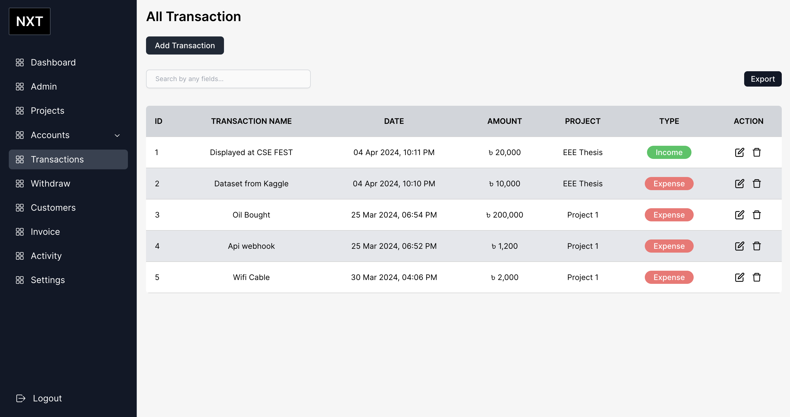

# Expense Management System

    
    
    
    

## Overview
The Expense Management System is a web application designed to help users track and manage their expenses efficiently. It provides a user-friendly interface for adding projects, and transactions, expenses and withdraw under a particular projects, helping individuals and businesses maintain control over their finances.

## Features
- **User Authentication**: Secure user authentication system to ensure data privacy and access control.
- **Expense Tracking**: Ability to add, edit, and delete expenses with customizable categories and tags.
- **Dashboard**: Interactive dashboard displaying summary.
- **Invoice**: Invoice Generator.
- **Multi-platform Access**: Accessible from desktop, tablet, and mobile devices for on-the-go expense management.

## Technologies Used
- **Frontend**: Next.js for server-side rendering and React for building interactive UI components.
- **Backend**: MongoDB for data storage and management.
- **Authentication**: JSON Web Tokens (JWT) for secure user authentication.
- **UI Library**: Maintine UI.
- **Styling**: Tailwind css for styling.
- **Deployment**: Hosted on vercel.

<!-- CONTACT -->
## Contact
For any inquiries or support, please contact-[Gmail](mailto:sajidislam729@gmail.com)

